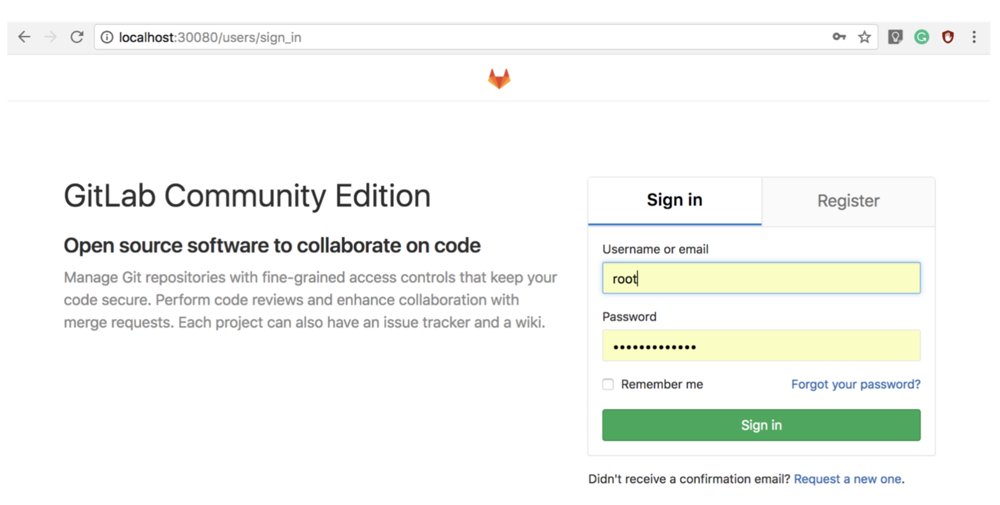
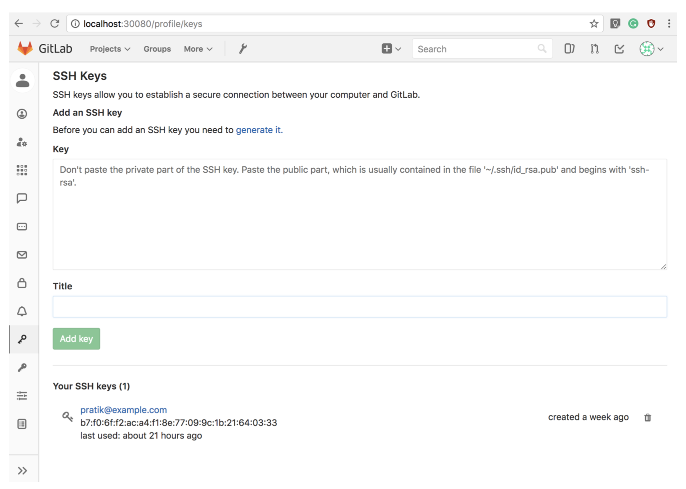
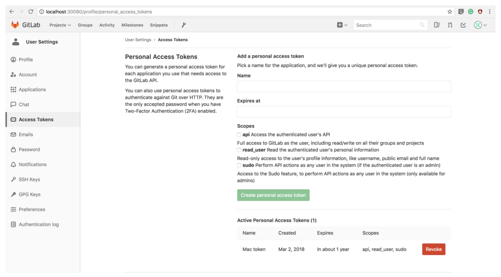
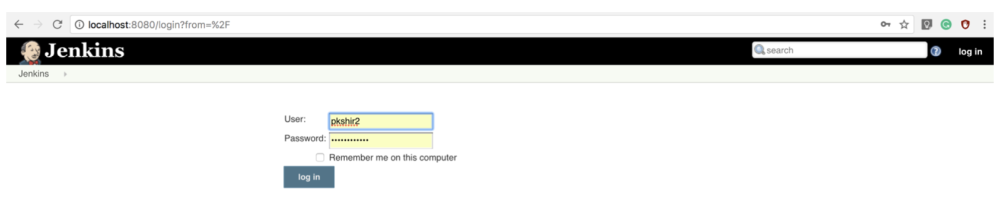
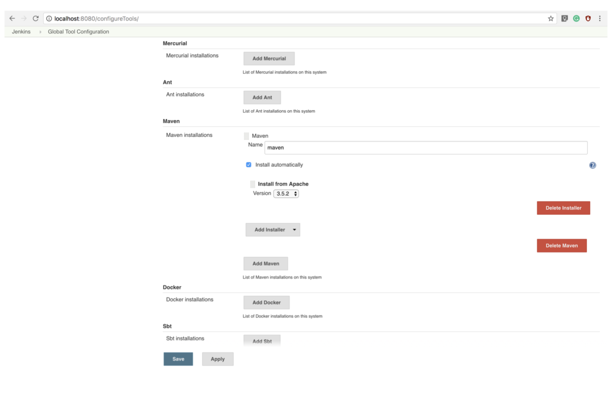
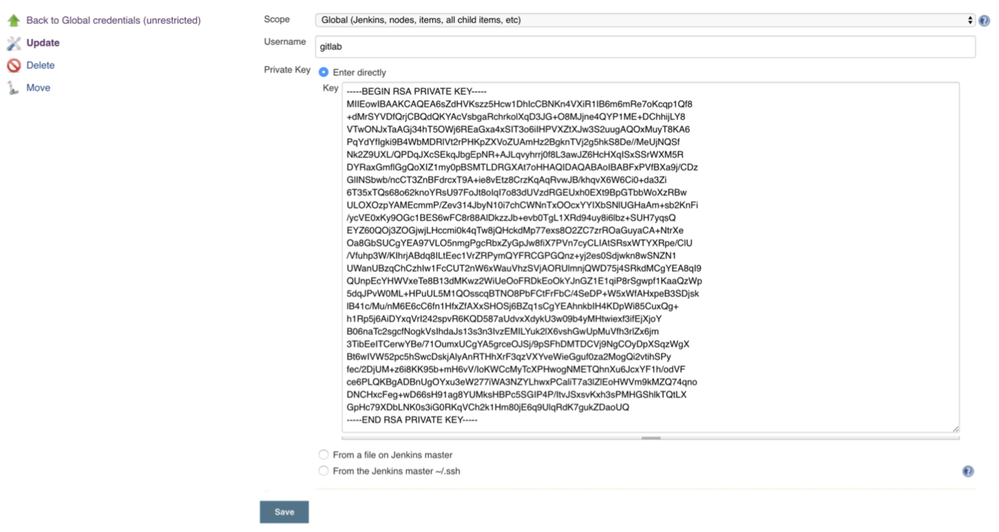
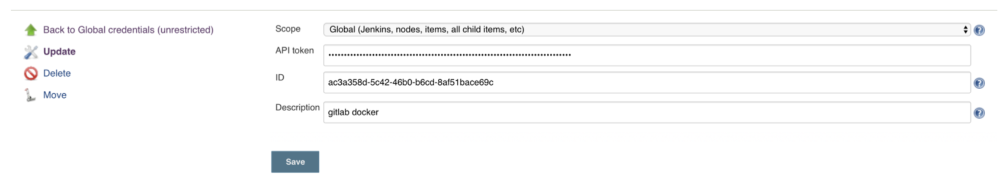
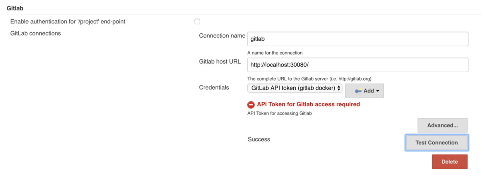

# DevOps I - Jenkins and GitLab CI/CD Service

> **Consume and adapt, adapt and evolve.**

## Problem Statement

Our task was to *simulate* a DevOps pipeline with multiple components such as Jenkins CI, our own GitLab server and SciTools Understand, a static code analyzer.

### Breaking down the problem

1. We installed Docker(Community Edition) so as to run a GitLab server as a container on our own local machines.
2. We installed and configured Jenkins on our system, locally.
3. We set up a GitLab server and then connected our Jenkins instance to our GitLab server.
4. The next step was importing open source repositories from GitHub and pushing them onto our GitLab server.
5. Once we cloned the repositories onto our GitLab server, we create Jenkins jobs that trigger a CI pipeline when there is a push event in any of the GitLab repositories.
6. For this we needed to set up Web-hooks between GitLab repositories and respective Jenkins jobs.
7. We then used a static code analysis tool called Understand to generate Dependency graphs and other Analysis reports.
8. We also used the “git diff” command to find out certain files that may required to be retested due to their newly modified state.

### Detailed Explanation of steps


### Generating SSH Keys

SSH keys are required for secure communication between Jenkins, GitLab server and our local machine which hosts these services. It is easy to create SSH keys as follows:

`ssh-keygen -t rsa -C “your_email@example.com"`

You can copy the generated ssh key onto clipboard as follows:

`pbcopy < ~/.ssh/id_rsa.pub` —> for copying the public part 

`pbcopy < ~/.ssh/id_rsa` —> copying the private part

### Installing Docker

We used Docker to run GitLab server in a container. To install docker, we
followed these steps (We used a Mac). It was a relatively simple process, a regular application installation through a wizard. The installer can be found [here](https:// store.docker.com/editions/community/docker-ce-desktop-mac)

### Installing GitLab

We ran GitLab CE as a container. So to get the server up and running, we had to execute the following script on the terminal. I have used my /Users/.../CS540/gitlab directory to create volumes for the container. This will help the container store data on my machine. Please change the path as per convenience. We have exposed various ports such as HTTP, HTTPS and SSH. The external URL points to the homepage of GitLab.

    sudo docker run --detach --name gitlab \
    --hostname gitlab.example.com \
    --restart always \
    --volume /Users/pratikkshirsagar/Desktop/CS540/gitlab/config:/
    etc/gitlab \
    --volume /Users/pratikkshirsagar/Desktop/CS540/gitlab/logs:/var/
    log/gitlab \
    --volume /Users/pratikkshirsagar/Desktop/CS540/gitlab/data:/var/
    opt/gitlab \
    --publish 30080:30080 \
    --publish 20080:80 \
    --publish 30022:22 \
    --publish 32768:443 \
    --env GITLAB_OMNIBUS_CONFIG="external_url 'http://
    gitlab.example.com:30080';
    gitlab_rails['gitlab_shell_ssh_port']=30022;" \
    gitlab/gitlab-ce:latest

### Configuring GitLab

Configuring GitLab was done entirely through the GUI. Once the container is up and running, which may take a few minutes to spin up, we can access GitLab at **http://localhost:30080** as we’ve set that as our external URL. We have to set up a **root** administrator account which has access to the entire server. We navigate to the ***settings*** panel from the drop down menu from the user icon at the top right corner.

Next, we set up our SSH key and a Private Access Token which can be used to authenticate API calls later used with Jenkins. Please refer the attached images.



<h4 align="center">Root Access</h4>



<h4 align="center">SSH Keys</h4>



<h4 align="center">Personal Access Tokens</h4>

### Installing Jenkins

We installed Jenkins natively on our machine. The installation process was
again simple. The wizard will automatically install Jenkins onto our system and then we have to set up an administrator account, initially with the hidden password, which we are prompted to change later on. The GUI is self-explanatory. By default, the Jenkins instance can be accessed at **http://localhost:8080**.



On your first run, the Jenkins instance will ask you for the temporary password. You can copy it using the command:

`sudo cat /Users/Shared/Jenkins/Home/secrets/initialAdminPassword`

Follow the default installation instructions per the screen and allow the default plugins to be installed. We will later install all the plugins we need to run our Jenkins jobs.

### Configuring Jenkins

We need to install the following plugins: Jacoco, Job DSL, XML Job to
Job DSL, All the Git plugins, All the GitLab plugins, All the Maven plugins. We then set up a maven installation for Jenkins as we will be using maven builds as part of our pipeline. This was done through Configure Jenkins -> Global Tool Config.



We need to create Jenkins global credentials in order to establish a connection between Jenkins and GitLab. This can be done through Credentials -> System -> Global -> Add credentials. We add two kinds of credentials: SSH key and GitLab Personal Access Token. Both of which were generated earlier.



<h4 align="center">Adding SSH Key</h4>



<h4 align="center">Adding GitLab API Token</h4>

### Integrating Jenkins with GitLab

We go to Manage Jenkins -> Configure System and add the GitLab host and credentials. We then test the connection, if successful that means our integration is ready to use. Make sure to select the right credentials and host URL.



<h4 align="center">Integrating Jenkins with GitLab</h4>

### Installing Understand

Install SciTools Understand. The professor has given us details of obtaining a educational license. With that, installing the application through a wizard is easy. Once installed, please add path of the und executable to the bash settings. (Export the Path variable.) We will be using the python API hence we need to add another path variable. 

    PATH=/Applications/Understand.app/Contents/MacOS/Python:$PATH          PATH=/Applications/Understand.app/Contents/MacOS:$PATH

The following part assumes that you have python3 installed on your system, along with the pip package installer. You can install python3 from [here](https://www.python.org/downloads/) and pip from [here](https://pip.pypa.io/en/stable/installing/).

Installing the dependencies: execute the following command from the root of the project directory, which contains the requirements.txt file.

`sudo pip3 install -r requirements.txt`

### Cloning Repositories from GitHub to GitLab

We have used GitHub’s REST API to filter out repositories that qualify two criteria: their language is “Java” and their build system is “Maven”.

The query is as follows:

    r = requests.get('https://api.github.com/search/repositories? q=language:java+topic:maven', auth = ("username", “password”))

We are essentially using the requests package in python that let’s us deal with HTTP requests. This request gives us a dump of repositories in JSON file. By parsing through the JSON file, we are able to clone each repo onto GitLab with the help of GitLab’s REST API.

The request is as follows:

    g = requests.post('http://localhost:30080/api/v4/projects', data = {'name':repo_name,'import_url':repo_url}, headers = {‘Private- Token’:'PRIVATE-TOKEN'})

Note that this POST request is accessing our GitLab host and creating a new project for every such request. We are using a single loop through the JSON file and cloning everything in one go.

### Creating Jenkins jobs

We create a Jenkins job which is essentially the pipeline that will be executed when the job runs. We first create a dummy job through the UI and then extract it’s config.xml. We then modify the XML for every job and create a job for every GitLab repository through a loop. We are using the **“python-jenkins”** and **“python-gitlab”** packages in order to do so.

### Structure of each Jenkins job

We have to specify the source repository URL, the credentials, the build triggers, the build step and the post build actions. For our Jenkins jobs, the configuration is as follows:

    Source Management : Specify the clone URL of GitLab repository.
    Credentials : SSH Key.
    Build Trigger : Build when a change is pushed to GitLab (Gitlab plugin comes handy.) Build Step: Maven build with tasks; clean compile test.
    Post Build Actions : Record Jacoco Coverage Report, Report Build Status to GitLab.
   
We feed this configuration into a job config.xml (XML to DSL plugin comes in handy.) Then using python-jenkins we can iteratively create Jenkins job for each GitLab project. Please refer to ‘output.xml’ as a sample.

### Setting up Webhooks for projects -> jobs

With the help of web hooks, every time we push a change into GitLab, the corresponding Jenkins job is triggered. We are creating Webhooks with the python-gitlab package.

The following snippet is an example of creating Jenkins jobs and setting up Webhooks for a project.

    server = jenkins.Jenkins('http://localhost:8080/', username='pkshir2', password='jenkinsrocks') # Pass Jenkins host URL and credentials.
    user = server.get_whoami()
    print('Hello %s from Jenkins' % (user['fullName']))
    gl = gitlab.Gitlab('http://localhost:30080', private_token='9SsFv3LD6ijhGznMSjuK') # Pass the gitlab host URL and generated private API token (from gitlab.)
    gl.auth()
    hooks = project.hooks.create({'url': 'projectURL', 'push_events': 1})


#### Installing Docker

*For Mac:* Install the stable version of Docker Community Edition for Mac from [here.](https://docs.docker.com/docker-for-mac/install/)

*For Windows:* Install the stable version of Docker Community Edition for Windows from [here.](https://docs.docker.com/docker-for-windows/install/#download-docker-for-windows) If your system does not meet the requirements for Docker CE for Windows, you can use [Docker Toolbox](https://docs.docker.com/toolbox/overview/)

#### Installing Gitlab

To launch GitLab, run the following Docker command in the docker command line interface:
```
sudo docker run --detach --name gitlab \
 --hostname gitlab.example.com \
 --restart always \ 
 --volume <Your_location_for_gitlab>/gitlab/config:/ etc/gitlab \    
 --volume <Your_location_for_gitlab>/gitlab/logs:/var/ log/gitlab \    
 --volume <Your_location_for_gitlab>/gitlab/data:/var/ opt/gitlab \ 
 --publish 30080:30080 \     
 --publish 20080:80 \ 
 --publish 30022:22 \ 
 --publish 32768:443 \ 
 --env GITLAB_OMNIBUS_CONFIG="external_url 'http:// gitlab.example.com:30080'; gitlab_rails['gitlab_shell_ssh_port']=30022;" \ 
 gitlab/gitlab-ce:latest

```

Wait a few minutes to let GitLab start inside the container. (You can view progress with docker logs -f gitlab.) Then, access GitLab via http://127.0.0.1:30080 (or, use your $DOCKER_HOST IP if you are not using localhost) and sign up. 

#### Installing Jenkins

Download the latest package for your system from [here.](https://jenkins.io/download/) Open the package and follow the instructions. Install the recommended plugins while setting up.

Once you have jenkins up and running, install the following plugins:

1. GitLab
2. Job DSL
3. Job DSL to XML
4. Jacoco
5. GitLab Auth
6. Git
7. Maven integration
8. Build with Parameters
9. SSH
10. Git Server
11. Git Client
12. SSH Credentials
13. SSH Agent
14. Violation Commit to GitLab
15. GitLab Hook

Configure the maven installation as per the documentation (HW1 Documentation.pdf)

#### Installing Python

Download the latest version of Python from https://www.python.org/downloads/. Make sure you download Python 3.x. as that is what we need for the [Understand API](https://scitools.com/support/python-api/)

#### Installing pip

Download the latest version of pip from https://pip.pypa.io/en/stable/installing/

#### Installing Understand

You can download the tool and apply for a non-commercial licence at https://scitools.com/non-commercial-license/. During the installation, check the box that lets you add Understand to the `PATH` variable(You can do this later too if you miss it). Once you have successfully installed the tool, you'll need to follow the steps given below to be able to use the [Python API](https://scitools.com/support/python-api/) for Understand

1. If you did not add Understand to the Path variable during installation, you will need to add the `SciTools/bin/<System>` directory to PATH.
On non-Windows systems, you may need to create an `STIHOME` environment variable that points to the <SciTools> directory.
2. Modify/Add the `PYTHONPATH` environment variable to include the module location, which is `SciTools/bin/<System>/Python`. For Mac users, the python module is in `Understand.app/Contents/MacOS/Python`. All that is necessary to load the module on Mac is to set `PYTHONPATH` to point to that directory and run python3. For example: `PYTHONPATH=/Applications/Understand.app/Contents/MacOS/Python python3`


## Description of the implementation

#### How to compile and run it

* In Main.py and Clone.py files, replace the Personal Access Token and URL of GitLab according to your setup. 
* Also you might have to change your network interface as a parameter in Main.py. (The default interface is the eth0 for WiFi on a Mac.)
* By that, we mean 'ipconfig getifaddr en0'

* run the following commands.

`sudo pip3 install -r requirements.txt`

`python3 Main.py`

* The repositories will be cloned into the root of the project and the Dependency graphs and other metrics generated by Understand will reside within these project folders.
    Developers can see their recommendations in the text file - RetestTheseFiles.txt, located in the root directory of the project.

* To run the acceptance tests run the following command

`nosetests --verbosity=2 <homework_repo_name>`

After running Main.py, your GitLab instance will have cloned all the repos from GitHub that meet the criteria of Language = Java.
You will also see all the Jenkins jobs have been generated and these jobs will trigger builds and Jacoco coverage reports on any push event in GitLab.   

#### Limitations of the implementation.
The repositories have to be cloned onto your local machine to generate the reports using the Understand API; This could have been done using a python/shell script in the jenkins build step, thus avoiding cloning the repositories locally.